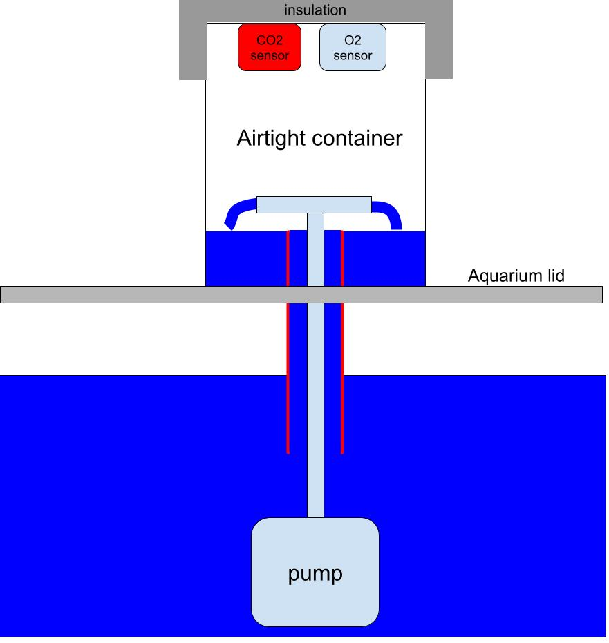
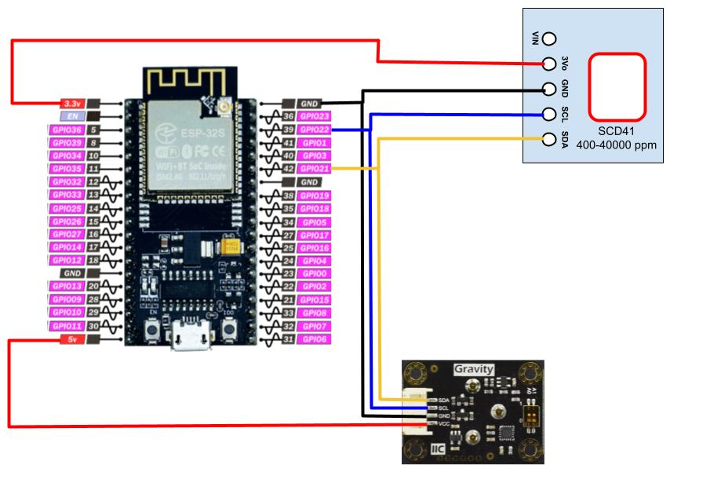
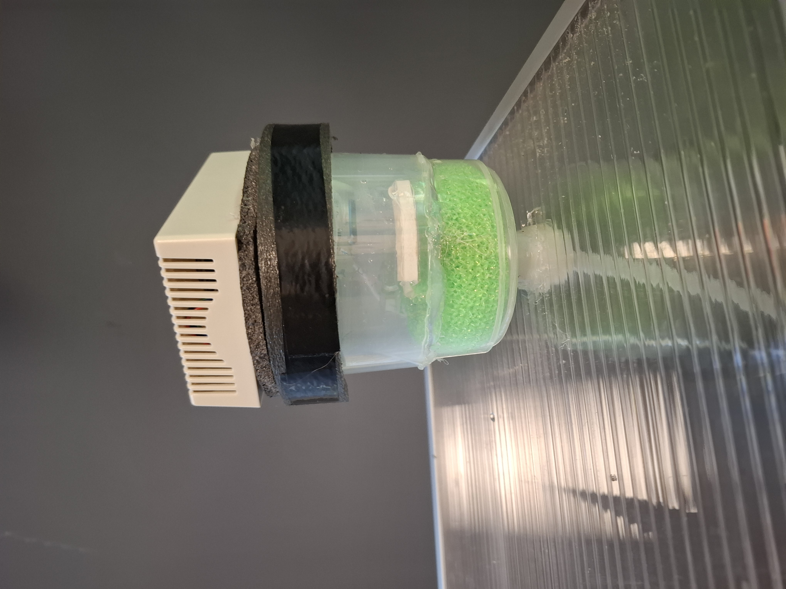
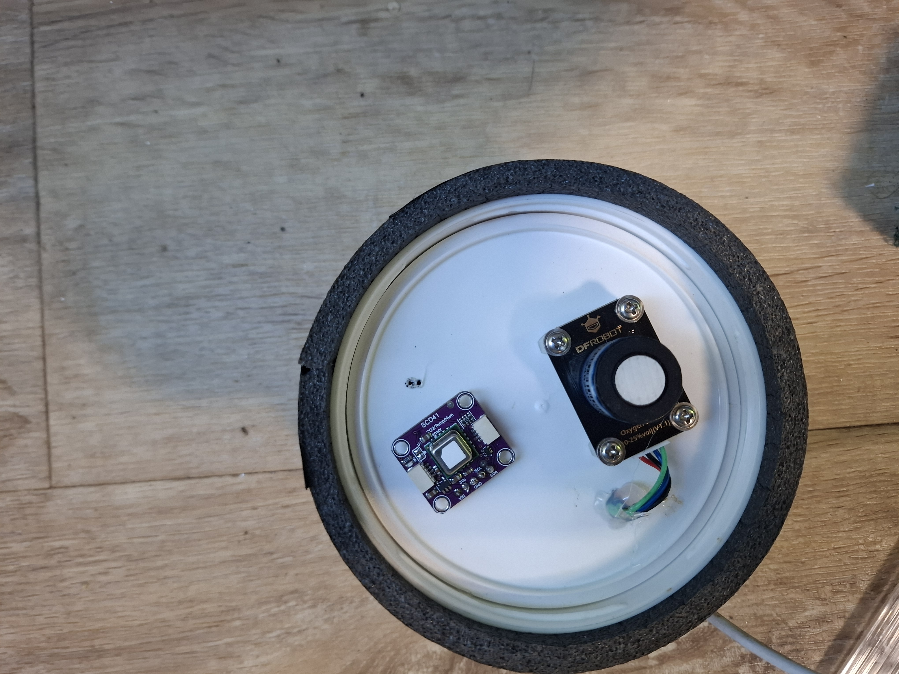
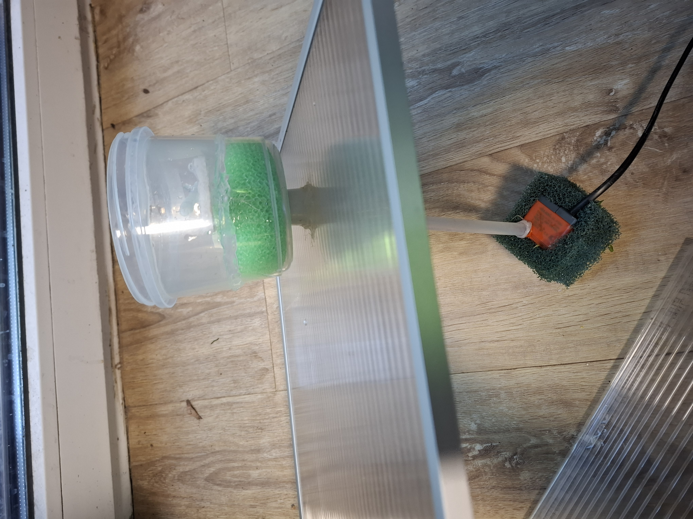
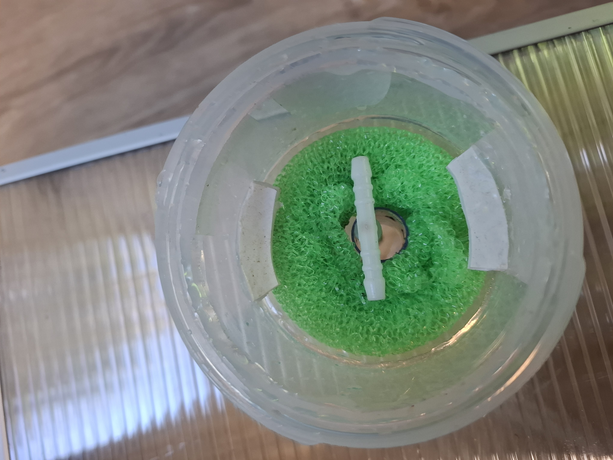
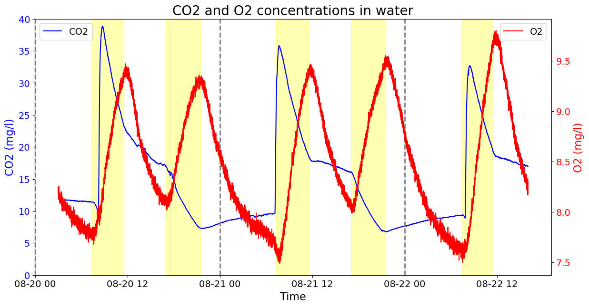

# Aqua Gas Monitor

An open-source project to monitor CO₂ and O₂ levels in an aquarium using a ESP32 board and gas sensors. The device continuously measures the concentration of carbon dioxide (CO₂) and oxygen (O₂) in your aquarium, helping to maintain optimal conditions for aquatic life.

## Table of Contents

- [Features](#features)
- [System Overview](#system-overview)
- [Hardware Requirements](#hardware-requirements)
- [Hardware Assembly](#hardware-assembly)
- [Software Setup](#software-setup)
- [Calibration](#calibration)
- [Gas Concentration Conversion](#gas-concentration-conversion)
- [Example Readings](#example-readings)
- [Usage](#usage)
- [Troubleshooting](#troubleshooting)
- [License](#license)
- [Contributions](#contributions)

## Features

- Real-time monitoring of CO₂ and O₂ levels.
- Wi-Fi connectivity using ESP32 board.
- MQTT support for data transmission.
- Simple calibration procedure using the onboard flash button.

## System Overview



*Figure 1: Overview of the Aqua Gas Monitor system.*

The Aqua Gas Monitor system consists of:

- **Gas Exchange Chamber**: An airtight box positioned above the aquarium lid, filled with plastic pot scrubbers to facilitate efficient gas exchange between water and air.
- **Sensors**:
  - **DFRobot Oxygen Sensor** (blue): Mounted on top of the chamber to measure O₂ concentration.
  - **SCD4X CO₂ Sensor** (red): Also mounted on top of the chamber to measure CO₂ concentration.
- **Water Pump**: Submerged in the aquarium, it circulates water through the chamber.
- **Pipes/Tubes**: Transport water from the aquarium to the chamber and back.
- **ESP32 Board**: Reads sensor data and transmits it over Wi-Fi.

## Hardware Requirements

- **ESP32 board** I used NodeMCU ESP-32S dual core WIFI, but other Arduino or 8266 boards would do it, install the board in the IDE accordingly
- **DFRobot Oxygen Sensor** [SEN322](https://www.dfrobot.com/product-2052.html)
- **SCD4X CO₂ Sensor**  [I used this one from Aliexpress](https://www.aliexpress.com/item/1005006660506915.html?spm=a2g0o.order_list.order_list_main.11.75d218027tHOSR)
- **Water pump** (suitable for aquarium use)
- **Airtight box/chamber** An airtight plastic container, preferably with a screw-on lid. The sensors can be attached to the bottom of the lid.
- **Plastic pot scrubber** (for gas exchange)
- **Pipes/Tubes** (aquarium-safe tubing)
- **Wires and connectors**
- **Power supply for ESP32**
- **Optional: Breadboard or PCB for assembling the circuit**
- **Push button** (optional, if not using the onboard flash button)

## Hardware Assembly

### 1. Build the Gas Exchange Chamber

- **Chamber Construction**:
  - Use an airtight box to serve as the gas exchange chamber. Position it above the aquarium lid.
  - Add a plastic pot scrubber into the chamber to increase the surface area for gas exchange between the water and the air inside the chamber.

- **Install the Sensors**:

  - Mount the **DFRobot Oxygen Sensor** (blue) and the **SCD4X CO₂ Sensor** (red) on the inside surface of the lid of the chamber. Ensure that the sensors are properly sealed to prevent any air leakage.

### 2. Set Up the Water Circulation


- **Water Pump Installation**:
  - Place the water pump at the bottom of the aquarium.

- **Piping**:
  - Connect a pipe from the pump to the gas exchange chamber to transport water upward.
  - Install a return pipe from the bottom of the chamber back to the aquarium to allow water to flow back.

### 3. Electrical Connections



*Figure 5: Wiring diagram for connecting sensors to the ESP32.*

- **Connect the Sensors to the ESP32**:

  - **DFRobot Oxygen Sensor**:
    - Connect the sensor's **SDA** and **SCL** pins to the ESP32's I²C pins (`GPIO 21` for SDA and `GPIO 22` for SCL by default).
    - Connect **VCC** to `3.3V` or `5V` and **GND** to `GND`.
    - Ensure the sensor's I²C address is set to `0x72` (ADDRESS_2). Refer to the sensor's documentation to set the I²C address if necessary. It can be adjusted with small switches on the back of the sensor.

  - **SCD4X CO₂ Sensor**:
    - Connect the sensor's **SDA** and **SCL** pins to the same I²C bus as the oxygen sensor.
    - Connect **VCC** to `3.3V` and **GND** to `GND`.

- **ESP32 Setup**:
  - Connect the ESP32 to a suitable power source (e.g., USB or external 5V power supply).

- **Calibration Button (Optional)**:
  - The calibration function uses the onboard flash button connected to `GPIO 0`. If you prefer an external button, connect a push button between `GPIO 0` and `GND`. Use the internal pull-up resistor (`INPUT_PULLUP` is set in the code).

Images of my setup:






## Software Setup

### 1. Install Arduino IDE and ESP32 Support

- Download and install the [Arduino IDE](https://www.arduino.cc/en/software).
- Install the ESP32 board support by following the instructions at [Espressif's Arduino-ESP32](https://github.com/espressif/arduino-esp32).
- Alternatively, other IDEs can be used (e.g. Visual Studio Code)
  
### 2. Install Required Libraries

Install the following Arduino libraries via the Library Manager (`Sketch` > `Include Library` > `Manage Libraries`):

- **WiFi** (included with ESP32 support)
- **PubSubClient** by Nick O'Leary
- **ArduinoJson** by Benoît Blanchon
- **DFRobot Oxygen Sensor Library** (SEN0322)
  - Install from [DFRobot_OxygenSensor Library](https://github.com/DFRobot/DFRobot_OxygenSensor).
- **SCD4X CO₂ Sensor Library**
  - Install from [DFRobot_SCD4X Library](https://github.com/DFRobot/DFRobot_SCD4X).

### 3. Clone or Download the Code

- Download this repository or clone it using:

  ```bash
  git clone https://github.com/gaborturu/aqua-gas-monitor.git
  ```

### 4. Configure `secrets.h`

- Rename `secrets_example.h` to `secrets.h`.
- Open `secrets.h` and fill in your Wi-Fi and MQTT credentials:

  ```cpp
  #ifndef SECRETS_H
  #define SECRETS_H

  const char* g_ssid = "YOUR WIFI SSID";
  const char* g_password = "YOUR WIFI PASSWORD";
  const char* g_mqtt_server = "YOUR MQTT SERVER IP ADDRESS";
  const char* g_mqttUser = "YOUR MQTT USER NAME";
  const char* g_mqttPsw = "YOUR MQTT PASSWORD";

  #endif
  ```

### 5. Upload the Code to ESP32

- Open the `aqua_gas_monitor.ino` file in the Arduino IDE.
- Ensure all required libraries are installed.
- Select the correct board and port:
  - Go to `Tools` > `Board` > `ESP32 Arduino` > `Node32s` (or the appropriate ESP32 model).
  - Select the correct COM port under `Tools` > `Port`.
- Compile and upload the sketch to the ESP32.

## Calibration

To ensure accurate readings, calibrate the sensors as follows:

1. **Prepare the Environment**:
   - Place the device in a well-ventilated area with known atmospheric conditions (e.g., outdoors).

2. **Start Calibration**:
   - Press and hold the calibration button (the onboard flash button on `GPIO 0`) for at least 2 seconds.
   - The device will enter calibration mode, which takes about 2 minutes.

3. **Calibration Process**:
   - During calibration, the O₂ sensor is calibrated to 20.9% (ambient air oxygen level).
   - The CO₂ sensor performs a forced recalibration to 400 ppm (ambient air CO₂ level).

4. **Completion**:
   - After calibration, the device resumes normal operation.

**Note**: Calibration should be performed periodically or if the readings appear inaccurate.

## Gas Concentration Conversion

The gas concentrations measured in the gas exchange chamber can be converted to the dissolved gas concentrations in the aquarium water (in mg/L) using Henry's Law. This is useful for understanding the actual amount of CO₂ and O₂ dissolved in the water.

### Henry's Law

Henry's Law states that the amount of dissolved gas in a liquid is proportional to its partial pressure above the liquid. The law can be expressed as:

$ C = k_H \times P $

Where:

- $ C $ = concentration of the dissolved gas in the liquid (mg/L)
- $ k_H $ = Henry's Law constant for the gas (mg/L·atm)
- $ P $ = partial pressure of the gas (atm)

### Constants Used

- **CO₂ Solubility Constant**: $ k_{H_{CO2}} = 1449 $ mg/L·atm
- **O₂ Solubility Constant**: $ k_{H_{O2}} = 40 $ mg/L·atm

### Calculating Partial Pressure

The partial pressure of the gas can be calculated from the measured concentration in the chamber:

For CO₂:

$$ P_{CO2} = \frac{\text{CO2 ppm}}{1,000,000} \times P_{\text{atm}} $$

For O₂:

$$ P_{O2} = \frac{\text{O2 \%}}{100} \times P_{\text{atm}} $$

Where:

- $ P_{\text{atm}} $ = atmospheric pressure (approx. 1 atm at sea level)

### Conversion Steps

#### For CO₂:

1. **Measure CO₂ Concentration**: Obtain the CO₂ concentration in parts per million (ppm) from the sensor.

2. **Calculate Partial Pressure**:

   $$ P_{CO2} = \frac{\text{CO2 ppm}}{1,000,000} \times 1 \text{ atm} $$

3. **Calculate Dissolved CO₂ Concentration**:

   $$ C_{CO2} = k_{H_{CO2}} \times P_{CO2} $$

#### For O₂:

1. **Measure O₂ Concentration**: Obtain the O₂ concentration in percent (%) from the sensor.

2. **Calculate Partial Pressure**:

   $$ P_{O2} = \frac{\text{O2 \%}}{100} \times 1 \text{ atm} $$

3. **Calculate Dissolved O₂ Concentration**:

   $$ C_{O2} = k_{H_{O2}} \times P_{O2} $$

### Example Calculations

#### Example for CO₂:

- Measured CO₂ concentration: 400 ppm

1. **Partial Pressure**:

   $$ P_{CO2} = \frac{400}{1,000,000} \times 1 \text{ atm} = 0.0004 \text{ atm} $$

2. **Dissolved CO₂ Concentration**:

   $$ C_{CO2} = 1449 \text{ mg/L·atm} \times 0.0004 \text{ atm} = 0.5796 \text{ mg/L} $$

#### Example for O₂:

- Measured O₂ concentration: 20.9%

1. **Partial Pressure**:

   $$ P_{O2} = \frac{20.9}{100} \times 1 \text{ atm} = 0.209 \text{ atm} $$

2. **Dissolved O₂ Concentration**:

   $$ C_{O2} = 40 \text{ mg/L·atm} \times 0.209 \text{ atm} = 8.36 \text{ mg/L} $$

### Notes

- **Temperature and Pressure**: The solubility constants are temperature-dependent. The values provided are approximate and assume standard conditions (25°C, 1 atm). For more accurate results, adjust the constants based on the actual temperature of the aquarium.
- **Units Consistency**: Ensure that all units are consistent when performing calculations.

## Example Readings

Below is a graph showing example readings of CO₂ and O₂ concentrations over several days.



*Figure 6: Example readings of CO₂ and O₂ concentrations over time.*

This graph illustrates how the concentrations of CO₂ and O₂ fluctuate in the aquarium environment. Photoperiods are marked with yellow regions, days are separated with vertical dashed lines. CO2 is injected in the morning with soda water. The graph shows the periodic CO2 and O2 changes during the photoperiods.

## Usage

- The device measures O₂ and CO₂ levels and transmits the data via MQTT.
- Data topics are published under `iotsensor/AGS`.

### MQTT Topics

- **Status Topic**: `iotsensor/AGS`
  - Payload example:

    ```json
    {
      "temp_2": 25.34,
      "oxy_2": 20.89,
      "humi_2": 45.67,
      "co2_2": 400
    }
    ```

- **Calibration Status**:
  - During calibration, the device publishes `{"calibration":1}`.
  - After calibration, it publishes `{"calibration":0}`.

## Troubleshooting

- **Wi-Fi Connection Issues**:
  - Ensure the SSID and password in `secrets.h` are correct.
  - Check that the ESP32 is within range of the Wi-Fi network.

- **MQTT Connection Issues**:
  - Verify the MQTT server IP, username, and password in `secrets.h`.
  - Ensure the MQTT broker is running and accessible.
  - Make sure to use different device names if multiple sensors are connected to the same mqtt broker

- **Sensor Readings Not Updating**:
  - Check the connections between the sensors and the ESP32.
  - Ensure the sensors are powered correctly.
  - Verify that the I²C addresses match the ones in the code.

- **Compilation Errors**:
  - Ensure all required libraries are installed and compatible with ESP32. Make sure that the right board is installed and selected in the IDE
  - If you encounter errors related to library versions, try updating the libraries via the Library Manager.

## License

This project is licensed under the MIT License - see the [LICENSE](LICENSE) file for details.

---

**Note**: Always test the device in a controlled environment before deploying it in your aquarium to ensure it functions correctly and safely.

## Contributions

Contributions are welcome! Please feel free to submit issues or pull requests to improve the project.

---

If you have any questions or need assistance, please open an issue on GitHub or visit the [UKAPS forum thread](https://www.ukaps.org/forum/threads/gas-exchange-experiments.72686/post-763584).

---
